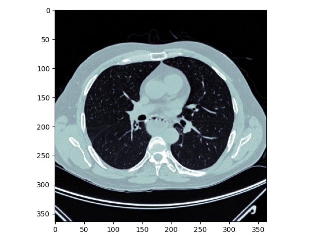
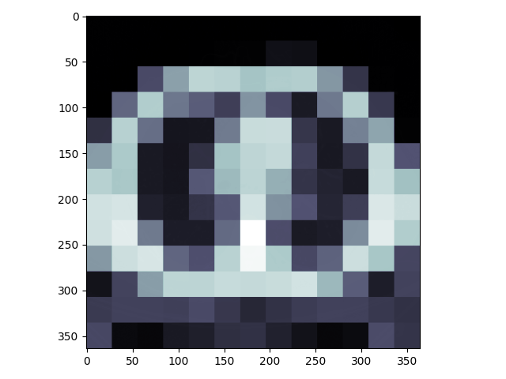

# CT-noise-statistical-characterization
Trying to implement the paper titled : "Statistical characterization of noise for spatial standardization of CT scans: Enabling comparison with multiple kernels and doses"
### results
Currently, I am testing the algorithm with small number of iterations (specially in the algorithm2). If you are interested to see the results, this is it:
The original image:

 

The stabilized image:

 
