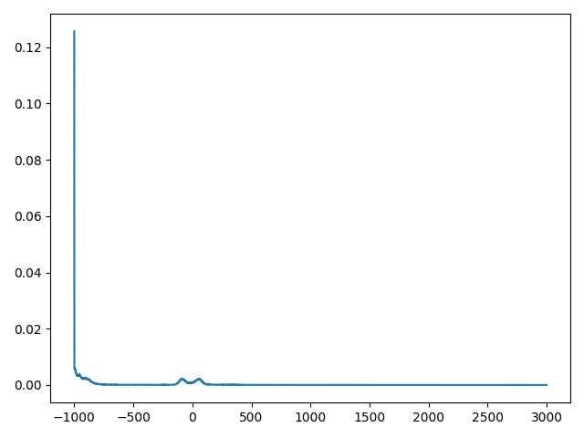
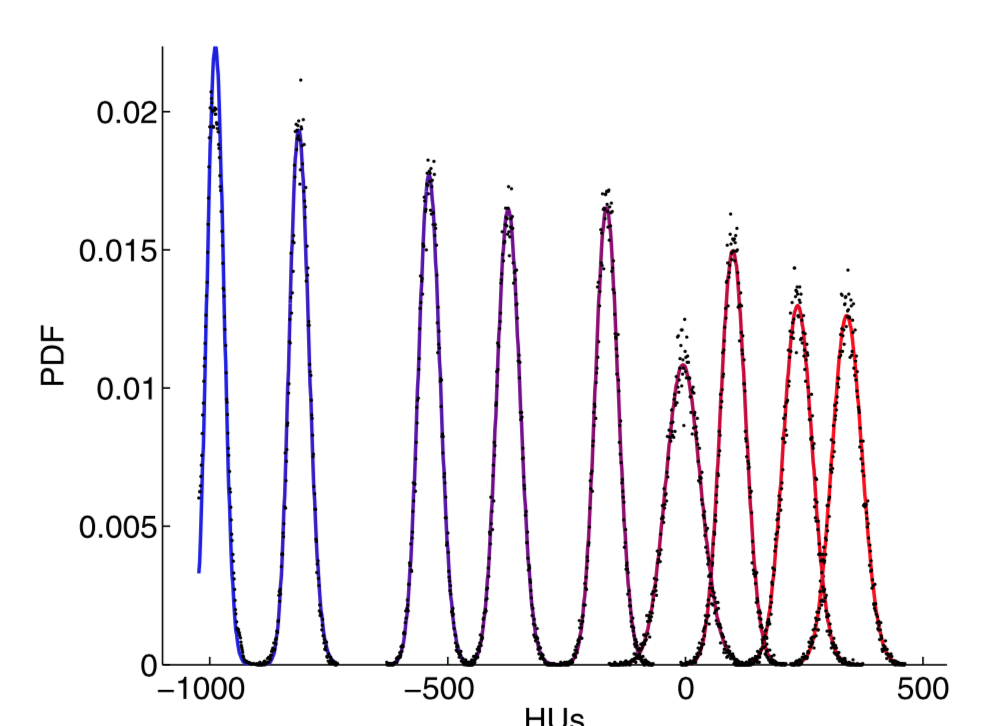

# CT-noise-statistical-characterization
Trying to implement the paper titled : "Statistical characterization of noise for spatial standardization of CT scans: Enabling comparison with multiple kernels and doses"
### results
Currently, I am testing the algorithm with small number of iterations (specially in the algorithm2). If you are interested to see the results, this is it:

The original image:

 

The stabilized image:

 

# Note
I found out if we set TOL so small, the second algorithm (also the third one as a consequence!) encounters a nan/nan division error, which is result of the value of some alphas being 0.0 (which makes the related betas "nan").
I think this may be the result of my ct scan image pdf value being like this:

But in the paper, the pdf is more like:

