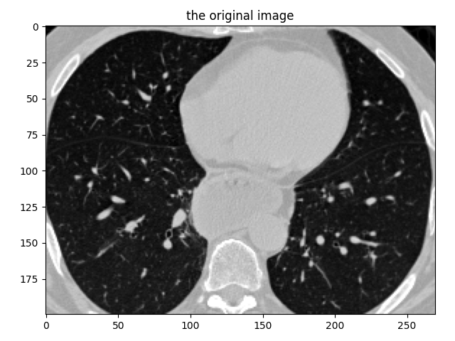
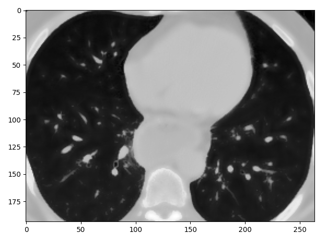

# CT-noise-statistical-characterization
Trying to implement the paper titled : "Statistical characterization of noise for spatial standardization of CT scans: Enabling comparison with multiple kernels and doses"
### results
Currently, I am debugging the algorithm(Since the original paper has got some errors). If you are interested to see the latest results, this is it:

### updated result

The original image:

 

The stabilized image:

 

# Not Working On It Anymore
